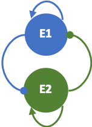
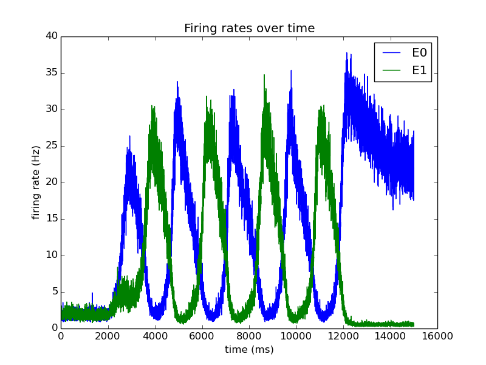

# Visual Target Selection Model

This repository contains the visual target selection model for a free viewing paradigm and example code on how to use the model.

### Model Description
We aim to model visual target selection for free-viewing paradigms. Our model is based on the decision-making model given by [Wong and Wang (2006)](http://www.jneurosci.org/cgi/doi/10.1523/JNEUROSCI.3733-05.2006), which simulates two mutually-inhibiting excitatory populations that exhibit winner-takes-all (WTA) behaviour.  In a free-viewing paradigm, several salient objects cause competition in the frontal eye fields (FEF) neurons so as to ensure fixation on one of the objects for a few (milli)seconds until another salient object causes the corresponding FEF neurons to ‘win’. Hence, we extend the WTA model of Wong and Wang to include switching behaviour. Switching implies that the two populations compete and alternate between high and low firing activity. Without such a mechanism, a simple WTA model would stay forever in one attractor state. A probable underlying mechanism for switching behaviour is the existence of a negative feedback loop from the motor neurons in the brainstem that execute saccade generation commands and the visual input itself  

### Model architecture
---
The model consists of two mutually inhibiting excitatory population with recurrent excitatory connections and both receive external and background input.  

### Requirements
---
| Package       | Version       |
|:-------------:|:-------------:|
| python        | >= 2.7        |
| numpy         | >= 1.8        |
| matplotlib    | >= 1.3        |

The code was created and tested on Linux and MacOS.

### Code execution
---
To execute example code, run `python usage.py` in a command line interface.

### Demo
---
The example code returns a plot of firing activity of the two populations over time. A noisy input of 44 Hz and 36 Hz to E0 and E1 respectively is switched on at 2 seconds, lasts for 10 seconds and is turned off for 3 seconds.

### Contact
---
For questions, bug reports, and suggestions about this work, please create an [issue](https://github.com/ccnmaastricht/target_selection/issues) in this repository.
